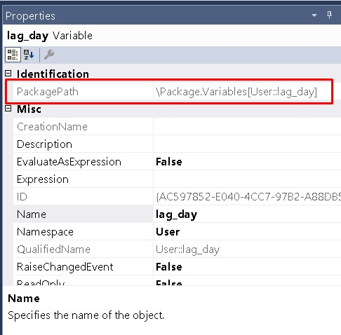
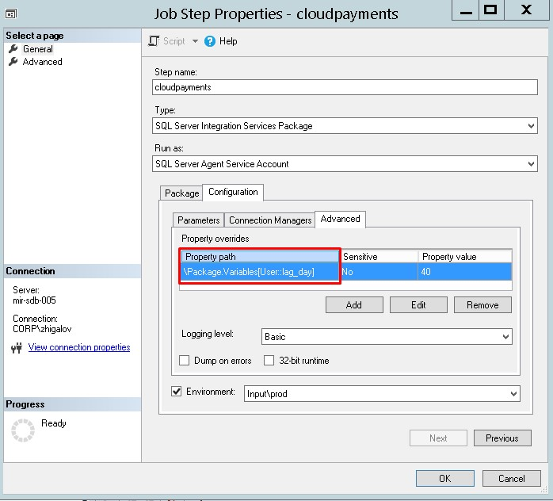

# Настройка JOB`а SQL SERVER Agent  

*[Синтаксис MarkDown](https://www.markdownguide.org/basic-syntax/)*  
[Заметки по SSIS](../SSIS_note.md)  

## Передача значения переменной пакета из шага JOB`а  

В пакете в свойствах переменной есть path

Его нужно использовать для передачи значения из JOB`а

В поле Property value задаётся значение, которое нужно передать в пакет.

